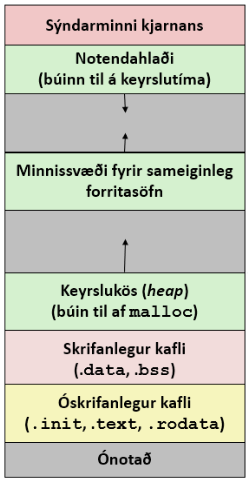

TÖL309G tölvutækni og forritun - lokapróf 2020
---

# 1
> hér fyrir neðan er fallið hmm sem ákvarðar hvort það séu tveir samliggjandi (adjacent) 0 bitar í inntakinu
```c
int hmm(unsigned int n) {
    return (~n) & (~n << 1);
}
```
## a.
> rekjið ykkur í gegnum einfaldaða útgáfu af fallinu sem vinnur með inntak sem er eitt bæti (í stað 4 bæta eins og fallið að ofan). notið gildin i) `n=01010101` og ii) `n=10010010`. sýnið einstök skref

það fyrsta sem fallið gerir er að flippa inntakinu sjá `(~n)` inntökin okkar yrðu þá `n1v=10101010` og `n2v=01101101`  
athugum næst hvað er hinum megin við bitwise ogun-ina, þar er aftur flippað og því síðan hliðrað til vinstri einu sinni þá endum við með `n1h=01010100` og `n2h=11011010`  
nú er bara að bitwise oga þessi gildi saman sjáum  

|  n#   |   (~n)   | (~n << 1) |  return  |
| :---: | :------: | :-------: | :------: |
|  n1   | 10101010 | 01010100  | 00000000 |
|  n2   | 01101101 | 11011010  | 01001000 |

hægt að prófa mismunandi útkomu með [þessu forriti](progs/s1.2020.c) ath að það er ekki 1:1, breytti int í char til að auðvelda lestur


## b.
> útskýrið almennt hvernig fallið að ofan vinnur

fallið flippar bitunum til þess að `0` verði `1` því við erum að leita að núllum ekki ásum, síðan ber það bara saman gildi sem eru hlið við hlið, með því að hliðra um einn færast hugsanlegir ásar sem voru hlið við hlið og eru núna bornir saman með `&`


## c.
> sýnið fall sem ákvarðar hvort það séu **þrír** samliggjandi 0-bitar í inntakinu. rökstyðjið að fallið ykkar virki rétt.

hérna getum við notað fallið fyrir ofan sem grunn, við vitum að ef við berum saman flippað og flippað + hliðrað gildi getum við borið saman nágranna, en til þess að kíkja líka á þriðja liðinn þurfum við að bæta við öðru `&` við f+h gildi þar sem hliðrunin er um tvo en ekki einn, sjá  
```c
int hmmm(unsigned int n) {
    return (~n) & (~n << 1) & (~n << 2);
}
```
upprunalegu tölurnar eru ekki að skila gildi, enda hafa þær ekki þrjú samliggjandi 0, þannig við bætum við nýrri tölu `00010010`
|  n#   |   (~n)   | (~n << 1) | (~ņ << 2) |  return  |
| :---: | :------: | :-------: | :-------: | :------: |
|  n1   | 10101010 | 01010100  | 10101000  | 00000000 |
|  n2   | 01101101 | 11011010  | 10110100  | 00000000 |
|  n3   | 11101101 | 11011010  | 10110100  | 10000000 |

þannig má sjá að þetta virkar fyrir þrjú gildi, líka hægt að prófa [hér](progs/s1.2020.c)


## d.
> sýnið fall sem ákvarðar hvort það séu tveir samliggjandi **1-bitar** í inntakinu. rökstyðjið fallið

nú getum við tekið `hmm()` fallið og eina sem þarf að breyta er að núna viljum við ekki flippa bitunum áður en við hliðrum og ogum, sjá
```c
int mmh(unsigned int n) {
    return n & (n << 1);
}
```
notum tölurnar fyrir ofan og setjum upp töflu, bætum líka einni tölu sem hefur `11`
|  n#   |    n     | (n << 1) |  return  |
| :---: | :------: | :------: | :------: |
|  n1   | 01010101 | 10101010 | 00000000 |
|  n2   | 10010010 | 00100100 | 00000000 |
|  n3   | 00010010 | 00100100 | 00000000 |
|  n4   | 01101011 | 11010110 | 01000010 |

eins og sjá má uppfyllir þetta formúluna, ég bæti þessu líka við í [forritið](progs/s1.2020.c)


# 2
> við skilgreinum 11-bita fleytitölur sem hegða sér á sambærilegan hátt og IEEE fleytitölurnar. fremsti bitinn er formerkisbiti, síðan koma 5 bitar fyrir veldishluta (exp) og loks 5 bitar fyrir brotahlutann (frac)

## a.
> sýnið minnstu jákvæðu tölu sem hægt er að tákna á stöðluðu formi í þessum tölum. sýnið bæði bitaframsetningu og gildi tölunnar. rökstyðjið svar ykkar

minnsta talan á stöðluðu formi væri mínustala með veldishluta sem er jafnstór og biasinn þannig það væri `01111`, þetta er vegna þess að staðlaðar tölur eru með veldi sem er minna eða jafnt og bíasinn  

ef við fylgjum öllum þessum reglum þá fáum við fleytitöluna `1-01111-11111` sem samkvæmt [mínum útreikningum](https://sjomli.is/fpc/?11?5?11111011111) er `-1.96875`

## b.
> táknið kommutöluna `-5.25` á þessu formi. sýnið útreikninga

fyrsta skref er að setja `1` fyrir mínusbitann, 1. skref af 3 komið  
næst þurfum við að finna út bias fleytitölunar, hann er reiknaður með $(2^{k-1})-1 = 2^4-1 = 15$, 2. skref komið  
nú kemur skref 3, ég þurfti virkilega að rifja þetta upp en held ég sé, allavega næstum, kominn með þetta  
byrjum á því að finna tvíundartöluna fyrir `5`, það sést strax að hún er `101`  
nú beitum við trixi til að finna restina af mantissunni, *manpissunni* 🤺, tökum `0.25` og margföldum með `2` við fáum `0.5` þannig fyrsta talan er `0`  
tökum næst `0.5` og gerum það sama, þá fáum við `1.0` þannig næsta tala er `1`  
þá er enginn afgangur og manpissan,🤺,  komin, hún er `101.01`  
hliðrum þess nú um `n` bita þannig að talan sé á forminu `1.xxxxx`, við þurfum að hliðra um `2` bita og þá er talan `1.01010`  
nú vitum við að brotahlutinn á að vera `01010` og veldið $2+bias = 17$  
binary fyrir `17` er `10001` og þá eru allir partar tölunar komnir, hún er `1-10001-01010`, sjá [hér](https://sjomli.is/fpc?11?5?11000101010)


## c. 
> hversu margar ólíkar tölur á bilinu `[1, 2)` er hægt að tákna með þessu formi (þ.e. hver er fjöldi ólíkra x-a, þannig að `1 <= x < 2`)? rökstyðjið.

til að svara þessari spurningu skulum við fyrst finna út hvernig bæði `1` og `2` eru táknaðar á þessu fleytitöluformi  
`1` í 5-bita binary er `1` þannig við þurfum ekki að hliðra neitt til að fá `1.00000`, setjum veldisbitann sem $0+bias$ þ.e. $15$ þá erum við með töluna `0-01111-00000`  
nú, vegna þess að við erum búin að finna `1` þá er ekkert mál að finna tvo, við einfaldlega tvöföldum töluna, þ.e. hækkum veldisbitastrenginn um 1, talan verður þá `0-10000-00000`  
þá er hægt að sjá að allar tölur sem eru stærri eða jafnar `0-01111-00000` og minni en `0-10000-00000` eru gildar, semsagt öll gildi brotastrengsins að veldisstrengnum óbreyttum  
þetta eru $2^5$ eða $32$ tölur  


## d. 
> hvað eru margir ólíkir bitastrengir sem gefa `NaN` í þessu formi? rökstyðjið

svipað og í dæminu fyrir ofan þá byggist svarið á því hversu margar mismunandi tölur brotastrengurinn getur búið til, nema hvað í þetta skipti er það líka margfaldað með `2` og dregið `2` frá útkomunni vegna þess að `NaN` og `-NaN` eru bæði gild gildi en ef brotastrengurinn er alveg `0` þá er gildið `inf` eða `-inf`, svarið er þessvegna $2*2^5=64$


# 3
> hér fyrir neðan er smalamálsútgáfa fallinu `long f(long n):
```asm
f:
    movl        $0, %eax
    movl        $0, %edx
    testq       %rdi, %rdi
    jle         .L3
.L7:
    leaq        (%rax, %rdx), %rcx
    testb       $7, %dl
    cmove       %rcx, %rax
    addq        $1, %rdx
    cmpq        %rdi, %rdx
    jne         .L7
.L3:
    ret
```

## a.
> upphaflega C-útgáfan af fallinu hefur for-lykkju. i) hvar er hún í kóðanum að ofan? ii) útskýrið tilgang einstakra gista í tengslum við for-lykkjuna

for lykkjan er í `.L7`  
það er farið inn í hana ef inntaks gistinn `%rdi` er stærri en `0`, við erum með tvö frumstillt gisti `%eax` og `%edx`  

`%eax` er skilagildið okkar, fyrir hvert loop inniheldur það `%rax` plús `%rdx` en aðeins ef neðstu 3 bitar í `%rdx` eru jafnt og `7`

`%edx` er counter inn í for lykkjunni, það sést greinilega í línu `#8` þegar bætt er 1 við gistið,for lykkjan stoppar þegar `%edx` og `%rdi` hafa sama gildi  


## b.
> í kóðanum að ofan er skipunin `testb $7, dl` hvað gerist í henni og hver er tilgangur hennar?

gistið `%dl` inniheldur lægstu 8 bita gistsins `edx` og það er verið að athuga hvort lægstu bitarnir séu jafngildir `7` í tíundarkerfi þ.e. `00000111`, ef svo er þá á að færa `%rcx` inn í `%rax`

## c.
> skrifið jafngilda útgáfu a fallinu í C. rökstyðjið einstakar skipanir í forritinu
```c
long f(long n) {
    long j = 0;                     // frumstillum %eax 
    if (n <= 0) return 0;           // hoppum í l3 ef 
    for (int i = 0; i < n; i++) {   // höldum áfram þangað til i er >= n
        if (!(i & 7)) j += i;       // tékkum á neðstu 3 bitunum
    }
    return j;                       // skilum loks %eax
}
```
*ath. ruglaði mig pínu í ríminu þetta `cmove` en það er jafngilt `cmovz` sem meikar strax meiri sens*

# 4
> hér fyrir neðan eru fjórar stuttar **sjálfstæðar** spurningar um x-86-64 smalamál

## a.
> útskýrið hver er munurinn á eftirfarandi tveimur x86-64 skipunum. sýnið jafngilda skipun í C
> - `mov    5, %rax`
> - `mov    5, (%rax)`

okidoki, fyrri skipunin er að setja töluna `5`  inn í gistið `%rax` sjá c kóða  
seinni skipunin er að setja `5` inn í minnisvæði `%rax`, dæmi um þetta væri ef tekið er tilvísunarviðfang og unnið með það
```c
void fyrri() {
    int x = 5;  // fyrri skipunin
}

void seinni(int *x) {
    *x = 5;
}
```

## b.
> útskýrið nákvæmlega hvað gerist í skipuninni `push %rbx`, þ.e. breytingar á minni og/eða gistum, og í hvaða röð breytingarnar gerast

x-86 skipuning `push` ýtir viðfangi á hlaðann, í þessu tilfelli `%rbx`  
við það að ýta á hlaðann lækkar gildið í `%esp` hlaðanum um stærð viðfangsins, gildið í `%esp` er minnisaddressa, og síðan er gildið í `%rbx` vistað á minnisvæðinu sem `%esp` heldur í 

## c.
> segjum að í X forriti sé skilgreind færslan `rec`. 
```c
struct rec {
    int k;
    short int b[20];
    float x;
}
```
> gerið ráð fyrir því að í smalamálskóða innihaldi gistið `%rax` bendi á færslu af taginu `rec` og gistið `%rdx` innihaldi heiltöluna `5`. með hliðsjón af því útskýrið hvað gerist í eftirfarandi x86-64 skipun. lýsið tilgangi allra hluta skipuninnar.
```asm
movzwq  4(%rax, %rdx, 2), %rbx
```

útreikningurinn sem verið er að útfæra er `(%rax + %rdx * 2)`, hér er verið að taka bendi á færslu `rec` og bæta við hana `%rdx` mörgum `short` stærðum, að lokum er svo lagt `4` við bendinn til þess að hoppa yfir k  
ef litið er á alla setninguna í heild er verið að færa `b[5]` í rec sem er orð , með 0-víkkun, yfir í fjórorð (quadword) breytuna  `%rbx`

## d.
> í C forritum eru `switch` setningar oft útfærðar með hopptöflum (jump table). stundum er þó hagkvæmara að útfæra þær með hreiðruðum `if` setningum. útskýrið hvenær er betra að nota hopptöflu, og hvenær hreiðruð if setning er hagkvæmari. rökstyðjið með einföldum dæmum.

ef verið er að vinna með gögn þar sem allar útkomur eru jafn líklegar er hraðara og hagstæðara að nota switch setningar, þar sem öll gögn töflunar hafa sama aðgangstíma  
hinsvegar ef verið er að vinna með gögn þar sem einhverjar útkomur eru líklegri en aðrar og útkomurnar eru ekki mikið fleiri en 4-5 er hagstæðara að nota if setningar, þetta er vegna þess að hægt er að setja algengustu útkomurnar efst og fá þessvegna hraðari aðgangstíma inn á þær

# 5
> í tölvukerfi er skyndiminni sem er 4KB að stærð. það er 4-vítt og hefur 16 mengi

## a.
> hver er línustærð skyndiminnis

## b.
> segjum að tölvukerfið hafi 32-vita vistföng. sýnið skiptingu þess í merkishluta (tag, CT), mengisnúmer (set index, CI) og línuhliðrun (block offeset, CO). rökstyðjið svar ykkar!

## c. 
> segjum að flest forrit hjá okkur noti stór fylki, sem farið er línulega í gegnum. ef við gætum breytt uppsetningu skyndiminnis hér að ofan, **án þess að breyta heildarstærð þess**,væri hagkvæmast að i) hækka víddina, ii) fjölga mengjunum eða iii) auka línustærðina? ræðið kosti þessara þriggja leiða og rökstyðjið hver þeirra væri best fyrir þessa tegund forrita

## d.
> segjum að í tölvukerfinu sé aðgangstími í aðalminni 100 klukkutif  
> skyndiminnið sem lýst er hér að ofan hefur aðgangstímann 4 klukkutif með notkun skyndiminnisins þá sýna prófanir að meðalaðganstíminn í tölvukerfinu er 8.8 klukkutif. hvert er smellahlutfallið í prófunum rökstyðjið

# 6
> hér fyrir neðan er C fallið `fall`:
```c
int N = 10;

int **fall() {
    int **a = (int**)malloc(N*sizeof(int));
    int i;
    for (i=0; i<N; i++)
        *a[i]=i;
    return a
}
```


## a.
> hér fyrir ofan er mynd af minnissvæðum notendaforrita í linux. fyrir eftirfanadi tákn/breytur í forritinu að ofan, segið í hvaða minnissvæði þau eru geymd:
> - N
> - fall
> - a
> - minnið sem a bendir á
> - i

> gerið ráð fyrir því að allar breytur séu geymdar í minni, ekki í gistum. rökstyðjið svörin í nokkrum orðum

- N, verandi frumstillt víðvær breyta er geymd í `.data` svæðinu
- fall, geymt, ásamt öllum öðrum kóða, í óyfirskrifanlega svæðinu `.text`
- a, er staðvær breyta innan falls þannig geymt á hlaðanum
- minnið sem a bendir á, er tekið frá af malloc og þessvegna geymt á kös
- i, eins og a er staðvær breyta innan falls þannig geymd á hlaða

## b.
> útskýrið tag og innihald breytanna N, a og i **rétt áður en for skipunin er framkvæmd**. þið getið rissað upp mynd eða útskýrt í orðum

- N er heiltala af taginu `int`, hún tekur upp `32` bita eða `4` bæti af minni og hefur gildið `10`
- a er bendir á heiltölu fylki, `integer array`, fylkið sem a bendir á getur haldið 10 heiltölum
- i er heiltölubreyta skilgreind inn í fallinu og er því geymd á hlaða

## c.
> það eru tvær slæmar minnisvillur í þessu falli. bendið á þær, útskýrið hvert vandamálin eru og stingið uppá lagfæringu á þeim

fyrsta minnisvillan sem ég sé er að það er verið skila bendi á gildi sem eru ekki til lengur, i er skilgreint á hlaða og gildin sem sett eru inn í fylkið sem a bendir á eru því ekki lengur til eftir keyrslu fallsins, held ég 🤷

