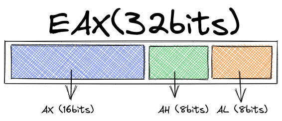
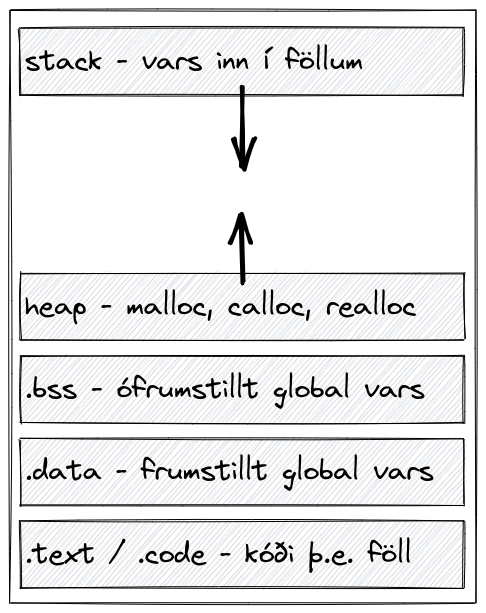
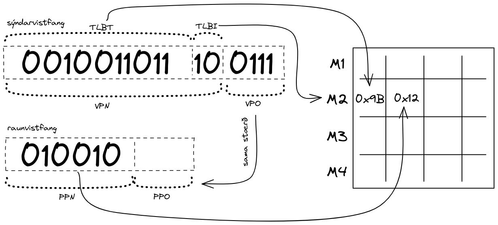
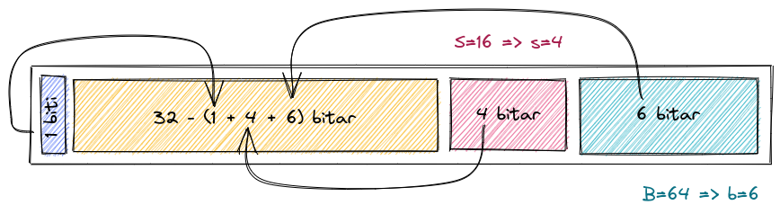

# assembly
## uppbrot gistis
  

## algengar skipanir
| skipun     | argument | lýsing                                                                                     |
| ---------- | -------- | ------------------------------------------------------------------------------------------ |
| mov        | x, y     | færir úr x yfir í y, *sjá conditional move fyrir neðan*                                    |
| push       | x        | ýtir x á hlaða og eftir að hækka `%ESP` um sizeof(x) bæti og sett þar inn                  |
| pop        | x        | skilar síðasta gildi sem var sett á hlaðann inn í x                                        |
| lea        | (x), y   | lea, betur þekkt sem leaq er notað til að framkvæma reikning `(x)` og setja útkomu inn í y |
| (x,y)      |          | skilar útkomu úr reikningi `x + y`                                                         |
| 0,(,x,y)   |          | skilar útkomu úr reikningi `x * y`                                                         |
| (x,y,z)    |          | skilar útkomu úr reikningi `x + y * z`                                                     |
| 2(x, y, z) |          | skilar útkomu úr reikningi `(2 + (x + y * z))`                                             |
| sar        | x, y     | hliðrar y um x bita til hægri, basically heiltöludeiling með x                             |
| sal        | x, y     | næstum eins og `sar` nema til vinstri, núna margföldun með $2^x$                           |
| sub        | x, y     | dregur y frá x                                                                             |
| inc/dec    | x        | hækkar/lækkar gildi x um 1                                                                 |

*ath. `SHL` og `SAL` gera það sama en `SHR` virkar ekki með signed int eins og `SAR` gerir*

## algeng mynstur
| mynstur               | skýring                                                                                    |
| --------------------- | ------------------------------------------------------------------------------------------ |
| testl %edi, %edi      | logical andað `edi` við `edi` þannig ef edi <= 0 er hægt að cmove eða jc í samræmi við það |
| cmove $5, %eax        | færðu 5 inn í `eax` ef z-flaggið er sett sem `1` þ.e. ef `edi` er tómt                     |
| leal 0(%rdi, %rdi, 4) | margfaldar %rdi með 5, (x + 4 * x)                                                         |

## conditional codes
þessir kóðar fara á endann á `cmov` skipunum þ.e. `cmov--` í línu eftir að eitthvað er testað eins og í dæmi
```asm
testb   $7, %dl
cmove   $1, %rax
```
þetta er pínu fucked dæmi því `e` flaggið í `cmove` stendur fyrir `equal` nema hvað við erum actually að athuga hvort útkomugildið sé `0`, þ.e. að enginn af neðstu 3 bitunum sé `1`, þá er gott að muna að `e` er jafngilt `z` 

þessi kóði færir `1` inn í `%rax` ef neðstu þrír bitar `%dl` eru ekki `111`

| cc     | condition                       |
| ------ | ------------------------------- |
| o      | overflow                        |
| no     | no overflow                     |
| b, nae | below, not above or equal       |
| nb, ae | not below, above or equal       |
| e, z   | equal (zero)                    |
| ne, nz | not equal, (not zero)           |
| na, be | not above, below or equal       |
| a, nbe | above, not below or equal       |
| s      | sign                            |
| ns     | no sign                         |
| p      | parity                          |
| np     | no parity                       |
| l, nge | less, not greater than or equal |
| nl     | not less, greater than or equal |
| ng, le | not greater, less than or equal |
| g, nle | greater, not less than or equal |

# minnissvæði
<!-- - `.text` - kóði og föll
  - hér eru öll föll geymd, svæðið er óyfirskrifanlegt svo að kóðinn geti ekki breytt sjálfum sér
- `.bss` - inniheldur ófrumstilltar breytur, (*uninitialized variables*)
  - ófrumstilltar víðværar breytur, (*global vars*), þar á meðal
    - bendar (*pointers*)
    - fastar (*constants*)
  - ófrumstilltar staðværar breytur, (*local static vars*) 
  - breytur hér eru **veikar**
  - **ath.** víðværar breytur, frumstilltar sem `0` eða `NULL` fara samt í `.bss`
- `.data` - inniheldur frumstilltar breytur
  - frumstilltar víðværar breytur, þar á meðal
    - bendar
    - fastar
  - frumstilltar staðværar breytur
  - **breytur hér eru sterkar**
- hlaði (*stack*) - breytur innan falla
  - staðværar breytur inn í falli, þar á meðal bendar
  - fallsviðföng (*function arguments*)
  - vendisvistfang (*return address)
- kös (*heap*) - minni on demand
  - minni úthlutað af `malloc`, `calloc` eða `realloc` -->



> ath. global breytur sem eru skilgreindar sem `0` eða `NULL` eru líka í `.bss`

# sýndarminni
- sýndarvistföng: `a` bitar
- raunvistföng: `b` bitar
- síðustærð: `c` bæti
- TLB: `d` vítt, `e` sæti
- fjöldi mengja: `f`

fjöldi mengja er reiknaður $\frac{e}{d}=f$

við erum með sýndarvistfang sem er `16` bitar sem skiptast í `4` mengi  
þá er **VPN** $\frac{3}{4}\times16$ bitar og **VPO** $4$ bitar  
**TBLT** og **TLBI** eru skipting á **VPN** þar sem **TBLI** eru neðstu tveir, *LSB*, bitar **VPN** og **TBLT** restin  
raunvistföngin eru jafn löng og **TLBT** og skipt niður í tvo hluta **PPN** og **PPO**, sem er jafn stór og **VPO** (í þessu tilfelli 4 bitar)  
  

annað dæmi, við erum með sýndarminni sem er 4kb að stærð, 4-vítt, `E`, og með 16 mengi, `S`,  svo útfrá þessum tölum finnum við línustærð, `B`, með reikningnum $\frac{4096}{16\times4}=64$  
skiptum þessu nú upp fyrir 32-bita vistfang:  


## klukkutifsformúla
$a + s \times r = m$  
- aðgangstími = $a$ (tif)
- smellahlutfall = $s$ (hlutfall)
- smellarefsing = $r$ (tif)
- meðalaðganstími = $m$ (tif)  
  
dæmi: 
- 97% smellahlutfall, $1 + 0.03 \times 100 = 4$
- 99% smellahlutfall, $1 + 0.01 \times 100 = 2$